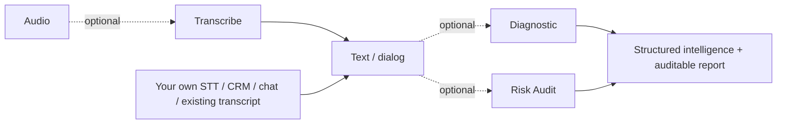

# io.github.actiontecbr/falaai-api — Java SDK for Conversation Intelligence, Speech Analytics & Compliance

[](https://central.sonatype.com/artifact/io.github.actiontecbr/falaai-api)
[](LICENSE)
[](https://github.com/ActionTecBr/falaai-api-java/actions/workflows/ci.yml)
[](https://actiontecbr.github.io/falaai-api-java/)

Official **Java SDK** for the **FalaAI API** — transcribe audio, analyze conversations and audit compliance (COPC CX, ISO 18295-1). **Use each API independently or combine them into your own pipeline.**

> Analyze calls, contact-center recordings, voice notes, chat and email. Get speaker-separated transcripts, summaries, reasons, actions, sentiment and a **compliance risk score**.

## Use any FalaAI API independently

FalaAI is a set of **independent REST APIs**. You **do not** need FalaAI Transcription to use FalaAI analysis or compliance auditing. If your application already has a transcript, send that text straight to the analysis APIs.

| If you have... | Use |
|---|---|
| Audio but no transcript | `SpeechApi` — Transcription |
| An existing transcript | `AnalysisApi` — Diagnostic |
| A transcript needing compliance analysis | `AnalysisApi` — Risk Audit |
| An existing transcript needing both | Diagnostic + Risk Audit |
| Your own STT provider (Whisper, Deepgram...) | Skip FalaAI Transcription |

```text
Your STT                             ->  FalaAI Diagnostic  ->  FalaAI Risk Audit
Telegram voice -> your STT           ->  FalaAI Risk Audit
3CX / Asterisk / Genesys transcript  ->  FalaAI Diagnostic  ->  FalaAI Risk Audit
CRM conversation                     ->  FalaAI Risk Audit
```

## Use the APIs the way you want

Every FalaAI API is **independent and optional** — chain any subset, in any combination.



> Skip **Transcribe** if you already have text. Call only **Diagnostic**, only **Risk Audit**, or both.

## Install

Maven:

```xml
<dependency>
  <groupId>io.github.actiontecbr</groupId>
  <artifactId>falaai-api</artifactId>
  <version>1.21.49</version>
</dependency>
```

Gradle:

```groovy
implementation 'io.github.actiontecbr:falaai-api:1.21.49'
```

## Quickstart

### 1. Get an API key
Create a free account and copy your `fai_` key: <https://falaai.action.tec.br/api/auth> (or the [Dashboard](https://falaai.action.tec.br/api/dashboard)).

### 2. Set environment variables

```bash
FALAAI_BASE_URL=https://api01-falaai.action.tec.br
FALAAI_API_KEY=fai_xxxxxxxx
```

### 3. Transcribe a call (audio -> text)

```java
import com.falaai.ApiClient;
import com.falaai.api.SpeechApi;
import java.io.File;

ApiClient client = new ApiClient();
client.setBasePath(System.getenv("FALAAI_BASE_URL"));
client.setBearerToken(System.getenv("FALAAI_API_KEY"));

SpeechApi speechApi = new SpeechApi(client);

var transcription = speechApi.createTranscriptionV1AudioTranscriptionsPost(
        new File("call.mp3"), "falaai-transcribe-1", "pt", "call_202609271408");

System.out.println(new com.google.gson.GsonBuilder().setPrettyPrinting().create().toJson(transcription));
```

Expected response (abridged):

```json
{
  "id": "tr-...",
  "object": "transcription",
  "model": "falaai-transcribe-1",
  "language": "por",
  "duration_seconds": 25.0,
  "text": "...",
  "dialog": "Speaker 1: [...] ...",
  "usage": { "audio_seconds": 25.0, "credits_consumed": 25, "processing_ms": 951 }
}
```

> Only need analysis? **Skip step 3** and call `AnalysisApi` with your own transcript (use the `text` field for a plain transcript).

### 4. Analyze or audit an existing transcript (no transcription needed)

```java
import com.falaai.ApiClient;
import com.falaai.api.AnalysisApi;
import com.falaai.model.DiagnosticRequest;
import com.falaai.model.RiskAuditRequest;
import java.math.BigDecimal;

ApiClient client = new ApiClient();
client.setBasePath(System.getenv("FALAAI_BASE_URL"));
client.setBearerToken(System.getenv("FALAAI_API_KEY"));
AnalysisApi analysis = new AnalysisApi(client);

String transcript = "Good morning, how can I help? I need to cancel my subscription.";

// 5 analyses in one call: summary, reason, action, topic, sentiment
DiagnosticRequest diagReq = new DiagnosticRequest();
diagReq.setText(transcript);
diagReq.setLanguage("pt-BR");
diagReq.setDurationSeconds(new BigDecimal("81.46"));
var diagnostic = analysis.createDiagnosticV1AnalyzeDiagnosticPost(diagReq);

// Compliance risk score + violations + auditable report
RiskAuditRequest auditReq = new RiskAuditRequest();
auditReq.setText(transcript);
auditReq.setLanguage("pt-BR");
auditReq.setResponseLanguage("pt-BR");
auditReq.setDurationSeconds(new BigDecimal("81.46"));
var audit = analysis.createRiskAuditV1AnalyzeRiskAuditPost(auditReq);
```

## What is FalaAI API?

FalaAI API is an **AI conversation-intelligence API** for analyzing customer-service, contact-center, sales, messaging and other business conversations. It combines speech-to-text (with speaker diarization and audio-event detection), conversation analysis (summary, contact reason, action taken, topic classification, sentiment) and a **compliance/risk audit** against **COPC CX** and **ISO 18295-1**. Conversation content is processed and discarded (zero-storage).

## What can you do with FalaAI?

- **Transcribe** audio to text with speaker separation and audio events.
- **Diagnose** a conversation: summary, reason, action taken, topic and sentiment.
- **Audit** conversations: compliance risk score, detections/violations and an auditable HTML report.
- **Track usage**, **manage webhooks** and **email alerts**, and **health/version** checks.

## Use cases

- **Contact center / Quality** — audit 100% of conversations instead of a sample.
- **Compliance / Legal** — auditable evidence for audits and disputes.
- **CX / Operations** — risk score, sentiment and reason per conversation.
- **BI / Data** — typed JSON ready for your database or analytics stack.

## SDK surface (Java)

| Class | Package | Purpose |
|---|---|---|
| `ApiClient` | `com.falaai` | `setBasePath()`, `setBearerToken()` |
| `HealthApi` | `com.falaai.api` | `healthCheck()`, `healthCheckHead()` |
| `SpeechApi` | `com.falaai.api` | `createTranscriptionV1AudioTranscriptionsPost(...)` |
| `AnalysisApi` | `com.falaai.api` | `createDiagnosticV1AnalyzeDiagnosticPost(...)`, `createRiskAuditV1AnalyzeRiskAuditPost(...)` |
| `UsageApi` / `WebhooksApi` / `EmailAlertsApi` / `VersionApi` | `com.falaai.api` | management |
| Models | `com.falaai.model` | `DiagnosticRequest`, `RiskAuditRequest`, `Participant`, `DiagnosticAudioEvent` |
| `ApiException` | `com.falaai` | HTTP errors |

> Model IDs: `falaai-transcribe-1`, `falaai-diagnostic-1`, `falaai-risk-audit-1`.

## Examples

Runnable examples in [`examples/`](./examples): `HealthExample.java`, `TranscribeExample.java`, `DiagnoseExample.java`, `AuditExample.java`.

## Authentication

Every request requires `Authorization: Bearer fai_<your_key>` — except the public endpoints (`GET/HEAD /v1/health`, `GET /api/version`). Set the key with `ApiClient.setBearerToken()` (or `FALAAI_API_KEY`).

## Error handling

Non-2xx responses throw `com.falaai.ApiException`.

```java
import com.falaai.ApiClient;
import com.falaai.ApiException;
import com.falaai.api.HealthApi;

try {
    var health = new HealthApi(client).healthCheck();
    System.out.println(health.getStatus());
} catch (ApiException e) {
    System.err.println("HTTP " + e.getCode() + ": " + e.getMessage());
}
```

## Where to integrate (this SDK)

FalaAI is language-independent; this package targets **Java** backends.

| Platform / environment (this SDK's language: **Java**) | Integration |
|---|---|
| **SAP** (Java) | `io.github.actiontecbr:falaai-api` (Java) |
| **Avaya** | `io.github.actiontecbr:falaai-api` (Java) |
| **Genesys** | `io.github.actiontecbr:falaai-api` (Java) |
| **Spring Boot / Jakarta EE** | `io.github.actiontecbr:falaai-api` |
| Other stacks (3CX, Salesforce, Odoo...) | REST / cURL — [API reference](https://api01-falaai.action.tec.br/docs) (or the SDK for that backend's language) |

> These are **integration examples**, not certified native integrations. Any platform can integrate through **REST / cURL** — see the [API reference](https://api01-falaai.action.tec.br/docs). Authenticated calls use `Authorization: Bearer fai_<key>`.

## Production usage

- Store API keys in environment variables or a secret manager — never hard-code.
- Reuse a single `ApiClient` across requests.
- Handle `com.falaai.ApiException` explicitly.
- Set sensible timeouts for long-running requests.

## Compatibility

| Requirement | Version |
|---|---|
| Java | 8+ |
| API | v1.21.49 |

## Documentation

- **SDK docs (this language):** <https://actiontecbr.github.io/falaai-api-java/>
- **API reference (Swagger UI):** <https://api01-falaai.action.tec.br/docs>
- **OpenAPI contract:** <https://api01-falaai.action.tec.br/openapi.json>
- **Sandbox:** <https://falaai.action.tec.br/api#playground>
- **Quickstart:** <https://falaai.action.tec.br/api/quickstart>
- **Product page:** <https://falaai.action.tec.br/api>

## Versioning

Semantic versioning; the SDK version tracks the API version (`1.21.49`). See [CHANGELOG.md](CHANGELOG.md) and [Releases](https://github.com/ActionTecBr/falaai-api-java/releases).

## Security

See [SECURITY.md](SECURITY.md). Never commit real keys — use environment variables.

## Contributing

See [CONTRIBUTING.md](CONTRIBUTING.md).

## License

[MIT](LICENSE).

## Links

- Website: <https://falaai.action.tec.br>
- API base URL: <https://api01-falaai.action.tec.br>
- GitHub organization: <https://github.com/ActionTecBr>
- Other SDKs: Python, Node.js, PHP, Go, Ruby, .NET.

### Platform documentation (orientation)

- SAP — <https://www.sap.com>
- Avaya — <https://developers.avayacloud.com>
- Genesys — <https://developer.genesys.cloud>